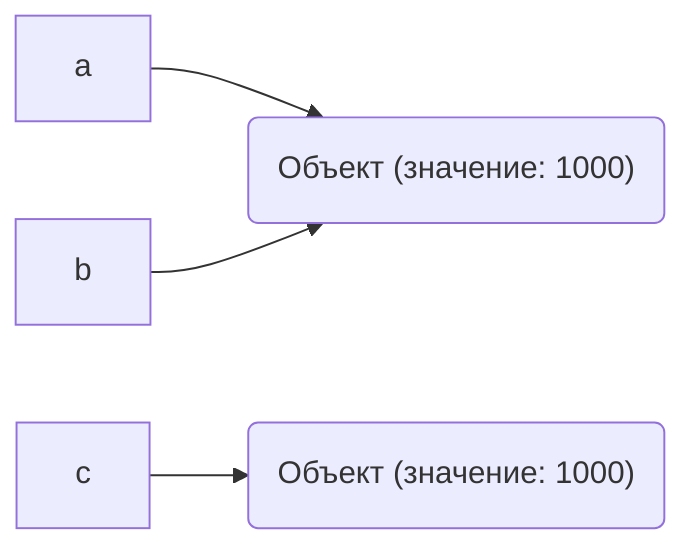

# Лабораторная работа 1
## Выполнение программы, объекты и базовые типы Python
## Задание 1. От исходного кода к байткоду
### Часть 1. Режимы запуска
#### Выполнение выражения в REPL
Было выполено выражение:
```python
2 + 3 * 4
```
Результат:
```text
14
```
В интерактивном режиме REPL результат вычесления выражения отображается автоматически
#### Выполнение выражения из файла
То же выражение было записано в файл "task_1.py"
```python
2 + 3 * 4
```
При запуске файла результат автоматически не отображается.
Так порисходит т.к. в REPL результат автоматический, а при запуске программы из файла результат нужно выводить самостоятельно
Для вывод была использована функция print()
```python
print(2 + 3 * 4)
```
Результат:
```text
14
```
#### Фактический результат и прогноз
Мой прогноз совпал с фактическим результатом: выражение "2 + 3 * 4" дало "14"
### Часть 2. Выражения и инструкции
В программу добавили:
```python
course = "Python"
hours = 4 * 2
print(f"{course}: {hours} часов")
```
#### Выражения
- `4 * 2`
- `f"{course}: {hours} часов"`
- `2 + 3 * 4`
- `"Python"`
- `print(...)`
#### Инструкции
- `course = "Python"`
- `hours = 4 * 2`
- `print(...)`
#### Литералы
- `"Python"`
- `4`
- `2`
- `3`
- `"часов"`
#### Имена, создаваемые при выполении
- `course`
- `hours`
### Часть 3. AST и байткод
#### Версия интерпретатора
В терминале была выполнена команда:
```text
python3 --version
```
Результат:
```text
Python 3.13.7
```
#### AST
В терминале была выполнена команда, для просмотра структуры программы:
```text
python3 -m ast task_1.py
```
Результат:
```text
Module(
   body=[
      Expr(
         value=Call(
            func=Name(id='print', ctx=Load()),
            args=[
               BinOp(
                  left=Constant(value=2),
                  op=Add(),
                  right=BinOp(
                     left=Constant(value=3),
                     op=Mult(),
                     right=Constant(value=4)))])),
      Assign(
         targets=[
            Name(id='course', ctx=Store())],
         value=Constant(value='Python')),
      Assign(
         targets=[
            Name(id='hours', ctx=Store())],
         value=BinOp(
            left=Constant(value=4),
            op=Mult(),
            right=Constant(value=2))),
      Expr(
         value=Call(
            func=Name(id='print', ctx=Load()),
            args=[
               JoinedStr(
                  values=[
                     FormattedValue(
                        value=Name(id='course', ctx=Load()),
                        conversion=-1),
                     Constant(value=': '),
                     FormattedValue(
                        value=Name(id='hours', ctx=Load()),
                        conversion=-1),
                     Constant(value=' часов')])]))])
```
В полученном AST найдены найдены такие узлы, как:
- `Assign` - присваивание
- `BinOp` - арифметика
- `Call` - вызов функции
### Байткод
В терминале была выполнена команда, для просмотра байткода:
```text
python3 -m dis task_1.py
```
Результат:
```text
0           RESUME                   0
1           LOAD_NAME                0 (print)
              PUSH_NULL
              LOAD_CONST               0 (14)
              CALL                     1
              POP_TOP
3           LOAD_CONST               1 ('Python')
              STORE_NAME               1 (course)
4           LOAD_CONST               2 (8)
              STORE_NAME               2 (hours)
5           LOAD_NAME                0 (print)
              PUSH_NULL
              LOAD_NAME                1 (course)
              FORMAT_SIMPLE
              LOAD_CONST               3 (': ')
              LOAD_NAME                2 (hours)
              FORMAT_SIMPLE
              LOAD_CONST               4 (' часов')
              BUILD_STRING             4
              CALL                     1
              POP_TOP
              RETURN_CONST             5 (None)
```
- `LOAD_CONST` - загрузка констант
- `CALL` - вызов функции
В полученном байткоде я нашла инструкции, которые отвечают за загрузку констант и вызов функции 
### Контрольный вопрос
Байткод нельзя считать машинным кодом процессора, т.к. это инструкция для Python, а не команды для процессора. Сначала Python обрабатывает этот байткод, а после программа выполняется. 
## Задание 2. Имена, объекты и сравнение
Запуск файла "task_2.py" и прогноз:
```python
#Прогноз:
#a == b True
#a is b True
#a == c True
#a is c False
a = 1000
b = a
c = int("1000")

print("Типы:", type(a), type(b), type(c))
print("Идентификаторы:", id(a), id(b), id(c))
print("a == b:", a == b)
print("a is b:", a is b)
print("a == c:", a == c)
print("a is c:", a is c)
```
Результат:
```text
Типы: <class 'int'> <class 'int'> <class 'int'>
Идентификаторы: 4372583376 4372583376 4371528560
a == b: True
a is b: True
a == c: True
a is c: False
```
#### 1. Схема

#### 2. Равенство и идентичность
`==` используется для сравнения значений объектов,
`is` проверяет является ли это одним и тем же объектом, проверяет совпадает ли `id` 
#### 3. Проверка None
Добавляем изменение переменной `c` и проводим проверку:
```python
c = None
print(c is None)
```
Результат:
```text
True
```
#### 4. Проверка строк
Выолняем код:
```python
first = "python"
second = "py" + "thon"

print(first == second)
print(first is second)
```
Результат:
```text
True
True
```
`==` проверил равенство значений строк,
`is` в данном запуске Python сделал так, что обе переменные указывают на один объект, поэтому получилось True. В другом случае `is` может дать False, даже если строки одинаковые. Т.к. Python экономит память только для коротких строк, которые похожи на имена переменных. 
#### 5. Правило использования `is` и `==`
`==` используется, когда нужно сравнить значение объектов, `is` используется, когда нужно проверить явл. ли объект тем же самым объектом, происходит сравнения их `id` 
### Контрольные вопросы
#### 1. Создает ли инструкция b = a копию объекта?
Нет, копия не создается. `b` начинает ссылаться на тот же объект, на который ссылается `a`. 
#### 2. Что возвращают type() и id()?
`type()` показывает тип объекта(`int`, `str` и т.д.), `id()' выводит индификатор, который используется для различия объектов. 
#### 3. Почему None принято сравнивать с помощью is, а числа и строки — с помощью ==?
` is None` используется потому, что None в памяти существует в единственном экземпляре и эту проверку нельзя переопределить. `==` для строк/чисел используется потому, что одинаковые строки и большие числа часто создают разные объекты в памяти, и проверка через is начнет выдавать ошибки.
## Задание 3. Числовые типы, операции и преобразования
### Эксперимент А. `int` и арифметические операторы
Запускаем код:
```python
x = 17
y = 5
print(x + y, type(x + y))
print(x - y, type(x - y))
print(x * y, type(x * y))
print(x / y, type(x / y))
print(x // y, type(x // y))
print(x % y, type(x % y))
print(x ** y, type(x ** y))
```
Результат:
```text
22 <class 'int'>
12 <class 'int'>
85 <class 'int'>
3.4 <class 'float'>
3 <class 'int'>
2 <class 'int'>
1419857 <class 'int'>
```
`/` это обычное деление сохраняющую дробную часть поэтому тип `float`, `//` это целочисленное деление без дробной части поэтому результат типа `int`
### Эксперимент B. Большие целые числа
Запускаем код:
```python
print(2 ** 1000)
```
Результат:
```text
10715086071862673209484250490600018105614048117055336074437503883703510511249361224931983788156958581275946729175531468251871452856923140435984577574698574803934567774824230985421074605062371141877954182153046474983581941267398767559165543946077062914571196477686542167660429831652624386837205668069376
```
Python умеет работать с очень большими целыми числами. Если число становится больше, Python может выделить для него больше памяти.
В некоторых других языках для целых чисел заранее устанавливается ограниченный размер, например 32 или 64 бита. Поэтому слишком большие числа там могут не помещаться. В Python размер int может увеличиваться вместе с числом.
### Эксперимент C. float
Запускаем код:
```python
import math
result = 0.1 + 0.2
print(result)
print(result == 0.3)
print(result - 0.3)
print(math.isclose(result, 0.3))
```
Результат:
```text
0.30000000000000004
False
5.551115123125783e-17
True
```
Причина такого результата заключается в том, что числа с плавающей точкой хранятся в двоичном виде. Некоторые десятичные дроби нельзя точно представить в двоичной системе. Из-за этого при вычислениях может появляться небольшая погрешность. Поэтому результат `0.1 + 0.2` немного отличается от 0.3.Для сравнения чисел типа `float` с учётом небольшой погрешности можно использовать функцию:
```text
math.isclose(a, b)
```
В данном случае она возвращает True, потому что учитывает небольшую погрешность вычислений(`a` близка по значению к `b`). 
### Эксперимент D. bool, complex и явное преобразование типов
Запускаем код:
```python
print(int("42"), type(int("42")))
print(float("3.14"), type(float("3.14")))
print(str(2026), type(str(2026)))
print(bool(0), type(bool(0)))
print(bool(-1), type(bool(-1)))
print(bool(""), type(bool("")))
print(bool("False"), type(bool("False")))
print(complex(2, -3), type(complex(2, -3)))
```
Результат:
```text
42 <class 'int'>
3.14 <class 'float'>
2026 <class 'str'>
False <class 'bool'>
True <class 'bool'>
False <class 'bool'>
True <class 'bool'>
(2-3j) <class 'complex'>
```
