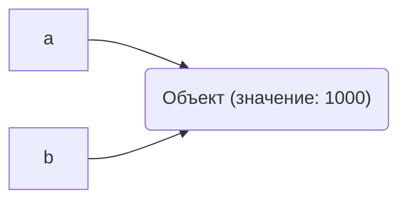

# Лабораторная работа 1
## Выполнение программы, объекты и базовые типы Python
## Задание 1. От исходного кода к байткоду
### Часть 1. Режимы запуска
#### Выполнение выражения в REPL
Было выполено выражение:
```python
2 + 3 * 4
```
Результат:
```text
14
```
В интерактивном режиме REPL результат вычесления выражения отображается автоматически
#### Выполнение выражения из файла
То же выражение было записано в файл "task_1.py"
```python
2 + 3 * 4
```
При запуске файла результат автоматически не отображается.
Так порисходит т.к. в REPL результат автоматический, а при запуске программы из файла результат нужно выводить самостоятельно
Для вывод была использована функция print()
```python
print(2 + 3 * 4)
```
Результат:
```text
14
```
#### Фактический результат и прогноз
Мой прогноз совпал с фактическим результатом: выражение "2 + 3 * 4" дало "14"
### Часть 2. Выражения и инструкции
В программу добавили:
```python
course = "Python"
hours = 4 * 2
print(f"{course}: {hours} часов")
```
#### Выражения
- `4 * 2`
- `f"{course}: {hours} часов"`
- `2 + 3 * 4`
- `"Python"`
- `print(...)`
#### Инструкции
- `course = "Python"`
- `hours = 4 * 2`
- `print(...)`
#### Литералы
- `"Python"`
- `4`
- `2`
- `3`
- `"часов"`
#### Имена, создаваемые при выполении
- `course`
- `hours`
### Часть 3. AST и байткод
#### Версия интерпретатора
В терминале была выполнена команда:
```text
python3 --version
```
Результат:
```text
Python 3.13.7
```
#### AST
В терминале была выполнена команда, для просмотра структуры программы:
```text
python3 -m ast task_1.py
```
Результат:
```text
Module(
   body=[
      Expr(
         value=Call(
            func=Name(id='print', ctx=Load()),
            args=[
               BinOp(
                  left=Constant(value=2),
                  op=Add(),
                  right=BinOp(
                     left=Constant(value=3),
                     op=Mult(),
                     right=Constant(value=4)))])),
      Assign(
         targets=[
            Name(id='course', ctx=Store())],
         value=Constant(value='Python')),
      Assign(
         targets=[
            Name(id='hours', ctx=Store())],
         value=BinOp(
            left=Constant(value=4),
            op=Mult(),
            right=Constant(value=2))),
      Expr(
         value=Call(
            func=Name(id='print', ctx=Load()),
            args=[
               JoinedStr(
                  values=[
                     FormattedValue(
                        value=Name(id='course', ctx=Load()),
                        conversion=-1),
                     Constant(value=': '),
                     FormattedValue(
                        value=Name(id='hours', ctx=Load()),
                        conversion=-1),
                     Constant(value=' часов')])]))])
```
В полученном AST найдены найдены такие узлы, как:
- `Assign` - присваивание
- `BinOp` - арифметика
- `Call` - вызов функции
### Байткод
В терминале была выполнена команда, для просмотра байткода:
```text
python3 -m dis task_1.py
```
Результат:
```text
0           RESUME                   0
1           LOAD_NAME                0 (print)
              PUSH_NULL
              LOAD_CONST               0 (14)
              CALL                     1
              POP_TOP
3           LOAD_CONST               1 ('Python')
              STORE_NAME               1 (course)
4           LOAD_CONST               2 (8)
              STORE_NAME               2 (hours)
5           LOAD_NAME                0 (print)
              PUSH_NULL
              LOAD_NAME                1 (course)
              FORMAT_SIMPLE
              LOAD_CONST               3 (': ')
              LOAD_NAME                2 (hours)
              FORMAT_SIMPLE
              LOAD_CONST               4 (' часов')
              BUILD_STRING             4
              CALL                     1
              POP_TOP
              RETURN_CONST             5 (None)
```
- `LOAD_CONST` - загрузка констант
- `CALL` - вызов функции
В полученном байткоде я нашла инструкции, которые отвечают за загрузку констант и вызов функции 
### Контрольный вопрос
Байткод нельзя считать машинным кодом процессора, т.к. это инструкция для Python, а не команды для процессора. Сначала Python обрабатывает этот байткод, а после программа выполняется. 
## Задание 2. Имена, объекты и сравнение
Запуск файла "task_2.py" и прогноз:
```python
#Прогноз:
#a == b True
#a is b True
#a == c True
#a is c False
a = 1000
b = a
c = int("1000")

print("Типы:", type(a), type(b), type(c))
print("Идентификаторы:", id(a), id(b), id(c))
print("a == b:", a == b)
print("a is b:", a is b)
print("a == c:", a == c)
print("a is c:", a is c)
```
Результат:
```text
Типы: <class 'int'> <class 'int'> <class 'int'>
Идентификаторы: 4372583376 4372583376 4371528560
a == b: True
a is b: True
a == c: True
a is c: False
```
#### 1. Схема



