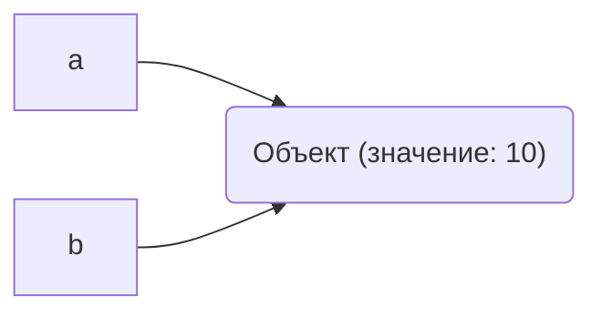
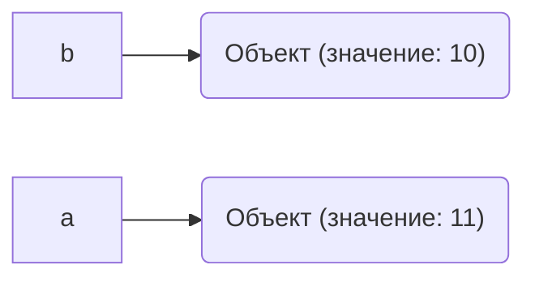

# Лабораторная работа 2.  Управление объектами и памятью в Python
## Задание 1. Имена, ссылки и изменяемость
### Эксперимент A. Неизменяемый объект
Запускаем код:
```python
a = 10
b = a

print(a, b)
print(id(a), id(b))

a += 1

print(a, b)
print(id(a), id(b))
```
Результат:
```text
10 10
4374086160 4374086160
11 10
4374086192 4374086160
```
После операции `a += 1` значение, связанное с именем `b`, не изменилось, потому что целые числа в Python неизменяемые объекты. Создался новый объект. Python вычисляет `10 + 1 = 11`, создаёт новый объект `11` в памяти.Имя `a` теперь ссылается на новый объект `11`, а имя `b` остаётся связанным со старым объектом.
### Эксперимент B. Изменяемый объект
Запускаем код:
```python
first = [10, 20]
second = first

print(first, second)
print(id(first), id(second))

second.append(30)

print(first, second)
print(id(first), id(second))
```
Результат:
```text
[10, 20] [10, 20]
4369019648 4369019648
[10, 20, 30] [10, 20, 30]
4369019648 4369019648
```
#### Схема
До `a += 1`:

После `a += 1`:


