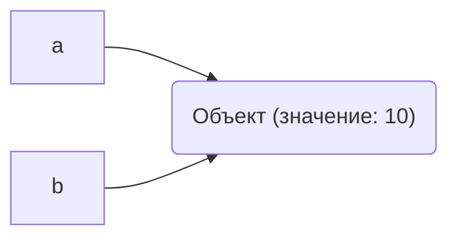
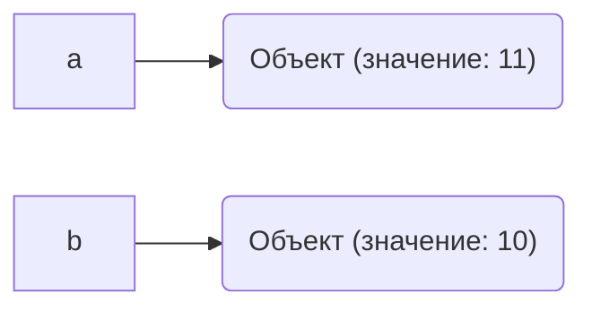
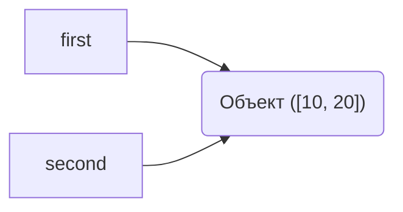
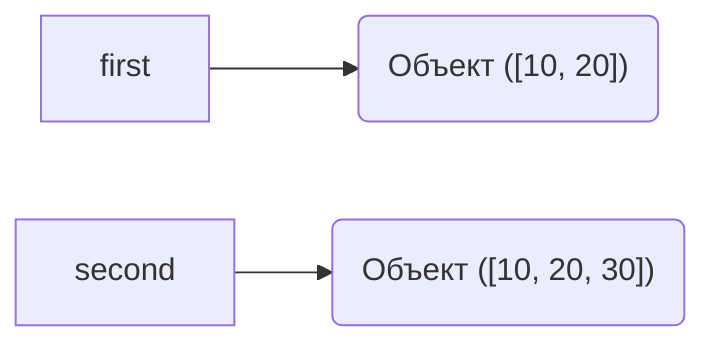

# Лабораторная работа 2.  Управление объектами и памятью в Python
## Задание 1. Имена, ссылки и изменяемость
### Эксперимент A. Неизменяемый объект
Запускаем код:
```python
a = 10
b = a

print(a, b)
print(id(a), id(b))

a += 1

print(a, b)
print(id(a), id(b))
```
Результат:
```text
10 10
4374086160 4374086160
11 10
4374086192 4374086160
```
#### Схема
До `a += 1`:

После `a += 1`:

После операции `a += 1` значение, связанное с именем `b`, не изменилось, потому что целые числа в Python неизменяемые объекты. Создался новый объект. Python вычисляет `10 + 1 = 11`, создаёт новый объект `11` в памяти.Имя `a` теперь ссылается на новый объект `11`, а имя `b` остаётся связанным со старым объектом.
### Эксперимент B. Изменяемый объект
Запускаем код:
```python
first = [10, 20]
second = first

print(first, second)
print(id(first), id(second))

second.append(30)

print(first, second)
print(id(first), id(second))
# Переназначение second
second = [10, 20, 30]

# Сравнение
print(first == second)    # True 
print(first is second)    # False 
# Изменение нового списка
second.append(40)

print(first, second)      # [10, 20, 30] [10, 20, 30, 40]
# first не изменился!
```
Результат:
```text
[10, 20] [10, 20]
4369019648 4369019648
[10, 20, 30] [10, 20, 30]
4369019648 4369019648
True
False
[10, 20, 30] [10, 20, 30, 40]
```
#### Схемы
До переназначения `second = [10, 20, 30]`:

После переназначения `second = [10, 20, 30]`::

### Практическая задача
Код:
```python
#Практическая задача
# создаем первую конфигурацию
config1 = {
    'Имя:': 'Проект Burmalda', 
    'Имена участников:': ['Даша', 'Маша'], 
    'Параметры запуска:': ['lr=0.01', 'b_size=32']
}
#Копия обычным присваиванием
config2 = config1
print(config1)
print(config2)
config2['Имена участников:'].append('Саша')
print(config1)
print(config2)
print(config1['Имена участников:'] is config2['Имена участников:'])

# независимое копирование
import copy
config3 = copy.deepcopy(config1)
print(config1)
print(config3)
config3['Имена участников:'].append('Петя')
print(config1)
print(config3)
print(config1['Имена участников:'] is config3['Имена участников:'])

assert 'Петя' not in config1['Имена участников:']
assert 'Петя' in config3['Имена участников:']
```
Результат:
```text
{'Имя:': 'Проект Burmalda', 'Имена участников:': ['Даша', 'Маша'], 'Параметры запуска:': ['lr=0.01', 'b_size=32']}
{'Имя:': 'Проект Burmalda', 'Имена участников:': ['Даша', 'Маша'], 'Параметры запуска:': ['lr=0.01', 'b_size=32']}
{'Имя:': 'Проект Burmalda', 'Имена участников:': ['Даша', 'Маша', 'Саша'], 'Параметры запуска:': ['lr=0.01', 'b_size=32']}
{'Имя:': 'Проект Burmalda', 'Имена участников:': ['Даша', 'Маша', 'Саша'], 'Параметры запуска:': ['lr=0.01', 'b_size=32']}
True
{'Имя:': 'Проект Burmalda', 'Имена участников:': ['Даша', 'Маша', 'Саша'], 'Параметры запуска:': ['lr=0.01', 'b_size=32']}
{'Имя:': 'Проект Burmalda', 'Имена участников:': ['Даша', 'Маша', 'Саша'], 'Параметры запуска:': ['lr=0.01', 'b_size=32']}
{'Имя:': 'Проект Burmalda', 'Имена участников:': ['Даша', 'Маша', 'Саша'], 'Параметры запуска:': ['lr=0.01', 'b_size=32']}
{'Имя:': 'Проект Burmalda', 'Имена участников:': ['Даша', 'Маша', 'Саша', 'Петя'], 'Параметры запуска:': ['lr=0.01', 'b_size=32']}
False
```
Простое присваивание:
- `is` -> True
- вложенные списки -> общие
- изменения config2 -> влияют на config1


Создании независимой конфигурации через `copy.deepcopy()`:
- `is` -> False
- вложенные списки -> независимые
- изменения config2 -> не влияют на config1
### Вопросы для анализа
#### 1. Меняет ли присваивание second = first сам объект?
Нет, не меняет. Присваивание в Python не копирует объекты и не изменяет их. Оно лишь создаёт новое имя на существующий объект. 
#### 2. Почему операция над неизменяемым объектом приводит к связыванию имени с другим объектом?
Потому что неизменяемые объекты нельзя изменить на месте. Python вычисляет новое значение и создаёт новый объект в памяти и переменная пересвязывается. 
#### 3. Как определить, что два имени обозначают один объект?
Использовать оператор `is` или функцию `id()`. 
## Задание 2. Поверхностное и глубокое копирование
Код:
```python
import copy

original = [
    ["Python", 5],
    ["Algorithms", 4],
]

alias = original
shallow = original.copy()
deep = copy.deepcopy(original)
print(id(original), id(alias), id(shallow), id(deep))
print(id(original[0]), id(alias[0]), id(shallow[0]), id(deep[0]))
print(id(original[0][1]), id(alias[0][1]), id(shallow[0][1]), id(deep[0][1]))

original.append(["Databases", 5])
print(id(original), id(alias), id(shallow), id(deep))
print(id(original[0]), id(alias[0]), id(shallow[0]), id(deep[0]))
print(id(original[0][1]), id(alias[0][1]), id(shallow[0][1]), id(deep[0][1]))

original[0][1] = 3
print(id(original), id(alias), id(shallow), id(deep))
print(id(original[0]), id(alias[0]), id(shallow[0]), id(deep[0]))
print(id(original[0][1]), id(alias[0][1]), id(shallow[0][1]), id(deep[0][1]))
```
Результат:
```text
4346955648 4346955648 4346966912 4346955776
4346955584 4346955584 4346955584 4346967296
4343497072 4343497072 4343497072 4343497072
4346955648 4346955648 4346966912 4346955776
4346955584 4346955584 4346955584 4346967296
4343497072 4343497072 4343497072 4343497072
4346955648 4346955648 4346966912 4346955776
4346955584 4346955584 4346955584 4346967296
4343497008 4343497008 4343497008 4343497072
```
Таблица наблюдений:
<table>
    <tr>
        <th>Операция</th>
        <th>Новый внешний объект</th>
        <th>Новые вложенные объекты</th>
        <th>Изменения независимы</th>
    </tr>
    <tr>
        <td>Присваивание</td>
        <td>-(id равны)</td>
        <td>-(id равны)</td>
        <td>-(id равны)</td>
    </tr>
    <tr>
        <td>Поверхностная копия</td>
        <td>+(id разный)</td>
        <td>-(id равны)</td>
        <td>-(для вложенных объектов),+(для внешних объектов)</td>
    </tr>
    <tr>
        <td>Глубокая копия</td>
        <td>+(id разный)</td>
        <td>+(id разный)</td>
        <td>+(id разный)</td>
    </tr>
</table>
