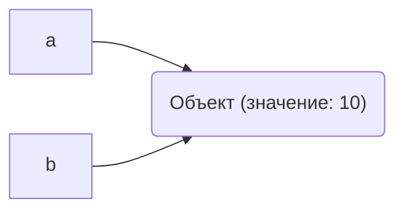
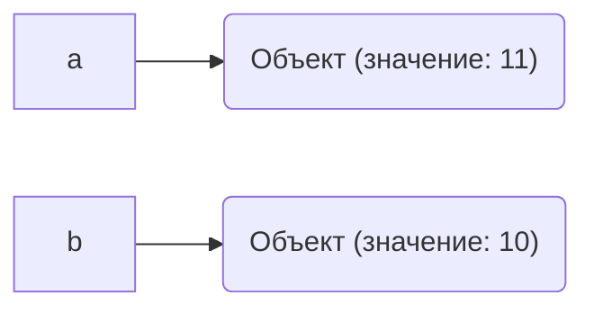
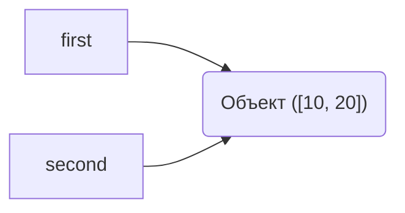
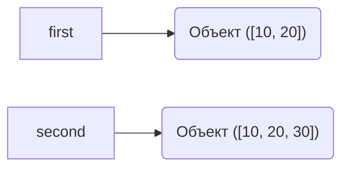

# Лабораторная работа 2.  Управление объектами и памятью в Python
## Задание 1. Имена, ссылки и изменяемость
### Эксперимент A. Неизменяемый объект
Запускаем код:
```python
a = 10
b = a

print(a, b)
print(id(a), id(b))

a += 1

print(a, b)
print(id(a), id(b))
```
Результат:
```text
10 10
4374086160 4374086160
11 10
4374086192 4374086160
```
#### Схема
До `a += 1`:

После `a += 1`:

После операции `a += 1` значение, связанное с именем `b`, не изменилось, потому что целые числа в Python неизменяемые объекты. Создался новый объект. Python вычисляет `10 + 1 = 11`, создаёт новый объект `11` в памяти.Имя `a` теперь ссылается на новый объект `11`, а имя `b` остаётся связанным со старым объектом.
### Эксперимент B. Изменяемый объект
Запускаем код:
```python
first = [10, 20]
second = first

print(first, second)
print(id(first), id(second))

second.append(30)

print(first, second)
print(id(first), id(second))
# Переназначение second
second = [10, 20, 30]

# Сравнение
print(first == second)    # True 
print(first is second)    # False 
# Изменение нового списка
second.append(40)

print(first, second)      # [10, 20, 30] [10, 20, 30, 40]
# first не изменился!
```
Результат:
```text
[10, 20] [10, 20]
4369019648 4369019648
[10, 20, 30] [10, 20, 30]
4369019648 4369019648
True
False
[10, 20, 30] [10, 20, 30, 40]
```
#### Схемы
До переназначения `second = [10, 20, 30]`:

После переназначения `second = [10, 20, 30]`::

### Практическая задача
Код:
```python
#Практическая задача
# создаем первую конфигурацию
config1 = {
    'Имя:': 'Проект Burmalda', 
    'Имена участников:': ['Даша', 'Маша'], 
    'Параметры запуска:': ['lr=0.01', 'b_size=32']
}
#Копия обычным присваиванием
config2 = config1
print(config1)
print(config2)
config2['Имена участников:'].append('Саша')
print(config1)
print(config2)
print(config1['Имена участников:'] is config2['Имена участников:'])
print(config1 is config2)

# независимое копирование
import copy
config3 = copy.deepcopy(config1)
print(config1)
print(config3)
config3['Имена участников:'].append('Петя')
print(config1)
print(config3)
print(config1['Имена участников:'] is config3['Имена участников:'])
print(config1 is config3)

assert 'Петя' not in config1['Имена участников:']
assert 'Петя' in config3['Имена участников:']
```
Результат:
```text
{'Имя:': 'Проект Burmalda', 'Имена участников:': ['Даша', 'Маша'], 'Параметры запуска:': ['lr=0.01', 'b_size=32']}
{'Имя:': 'Проект Burmalda', 'Имена участников:': ['Даша', 'Маша'], 'Параметры запуска:': ['lr=0.01', 'b_size=32']}
{'Имя:': 'Проект Burmalda', 'Имена участников:': ['Даша', 'Маша', 'Саша'], 'Параметры запуска:': ['lr=0.01', 'b_size=32']}
{'Имя:': 'Проект Burmalda', 'Имена участников:': ['Даша', 'Маша', 'Саша'], 'Параметры запуска:': ['lr=0.01', 'b_size=32']}
True
True
{'Имя:': 'Проект Burmalda', 'Имена участников:': ['Даша', 'Маша', 'Саша'], 'Параметры запуска:': ['lr=0.01', 'b_size=32']}
{'Имя:': 'Проект Burmalda', 'Имена участников:': ['Даша', 'Маша', 'Саша'], 'Параметры запуска:': ['lr=0.01', 'b_size=32']}
{'Имя:': 'Проект Burmalda', 'Имена участников:': ['Даша', 'Маша', 'Саша'], 'Параметры запуска:': ['lr=0.01', 'b_size=32']}
{'Имя:': 'Проект Burmalda', 'Имена участников:': ['Даша', 'Маша', 'Саша', 'Петя'], 'Параметры запуска:': ['lr=0.01', 'b_size=32']}
False
False
```
Простое присваивание:
- `is` -> True
- вложенные списки -> общие
- изменения config2 -> влияют на config1


Создании независимой конфигурации через `copy.deepcopy()`:
- `is` -> False
- вложенные списки -> независимые
- изменения config2 -> не влияют на config1
### Вопросы для анализа
#### 1. Меняет ли присваивание second = first сам объект?
Нет, не меняет. Присваивание в Python не копирует объекты и не изменяет их. Оно лишь создаёт новое имя на существующий объект. 
#### 2. Почему операция над неизменяемым объектом приводит к связыванию имени с другим объектом?
Потому что неизменяемые объекты нельзя изменить на месте. Python вычисляет новое значение и создаёт новый объект в памяти и переменная пересвязывается. 
#### 3. Как определить, что два имени обозначают один объект?
Использовать оператор `is` или функцию `id()`. 
## Задание 2. Поверхностное и глубокое копирование
Код:
```python
import copy

original = [
    ["Python", 5],
    ["Algorithms", 4],
]

alias = original
shallow = original.copy()
deep = copy.deepcopy(original)
print(id(original), id(alias), id(shallow), id(deep))
print(id(original[0]), id(alias[0]), id(shallow[0]), id(deep[0]))
print(id(original[0][1]), id(alias[0][1]), id(shallow[0][1]), id(deep[0][1]))

original.append(["Databases", 5])
print(id(original), id(alias), id(shallow), id(deep))
print(id(original[0]), id(alias[0]), id(shallow[0]), id(deep[0]))
print(id(original[0][1]), id(alias[0][1]), id(shallow[0][1]), id(deep[0][1]))

original[0][1] = 3
print(id(original), id(alias), id(shallow), id(deep))
print(id(original[0]), id(alias[0]), id(shallow[0]), id(deep[0]))
print(id(original[0][1]), id(alias[0][1]), id(shallow[0][1]), id(deep[0][1]))
```
Результат:
```text
4346955648 4346955648 4346966912 4346955776
4346955584 4346955584 4346955584 4346967296
4343497072 4343497072 4343497072 4343497072
4346955648 4346955648 4346966912 4346955776
4346955584 4346955584 4346955584 4346967296
4343497072 4343497072 4343497072 4343497072
4346955648 4346955648 4346966912 4346955776
4346955584 4346955584 4346955584 4346967296
4343497008 4343497008 4343497008 4343497072
```
Таблица наблюдений:
<table>
    <tr>
        <th>Операция</th>
        <th>Новый внешний объект</th>
        <th>Новые вложенные объекты</th>
        <th>Изменения независимы</th>
    </tr>
    <tr>
        <td>Присваивание</td>
        <td>-(id равны)</td>
        <td>-(id равны)</td>
        <td>-(id равны)</td>
    </tr>
    <tr>
        <td>Поверхностная копия</td>
        <td>+(id разный)</td>
        <td>-(id равны)</td>
        <td>-(для вложенных объектов),+(для внешних объектов)</td>
    </tr>
    <tr>
        <td>Глубокая копия</td>
        <td>+(id разный)</td>
        <td>+(id разный)</td>
        <td>+(id разный)</td>
    </tr>
</table>

### Матрицы
```python
wrong_matrix = [[0] * 3] * 3
print(wrong_matrix)
print(id(wrong_matrix[0]), id(wrong_matrix[1]), id(wrong_matrix[2]))

wrong_matrix[0][0] = 1
print(wrong_matrix)
print(id(wrong_matrix[0]), id(wrong_matrix[1]), id(wrong_matrix[2]))

correct_matrix = [[0] * 3 for _ in range(3)]
print(correct_matrix)
print(id(correct_matrix[0]), id(correct_matrix[1]), id(correct_matrix[2]))

correct_matrix[0][0] = 1
print(correct_matrix)
print(id(correct_matrix[0]), id(correct_matrix[1]), id(correct_matrix[2]))
```
Результат:
```text
[[0, 0, 0], [0, 0, 0], [0, 0, 0]]
4304188864 4304188864 4304188864
[[1, 0, 0], [1, 0, 0], [1, 0, 0]]
4304188864 4304188864 4304188864
[[0, 0, 0], [0, 0, 0], [0, 0, 0]]
4304189568 4304189696 4304189632
[[1, 0, 0], [0, 0, 0], [0, 0, 0]]
4304189568 4304189696 4304189632
```
Объяснение различий: `[0] * 3` создаёт один список, `[[0] * 3] * 3` создаёт три ссылки на один и тот же список, все три матрицы - один объект в памяти. А `[[0] * 3 for _ in range(3)]` цикл выполняет команду три раза и каждый раз создаёт новый список, разный объект в памяти. 
### Вопросы для анализа
#### 1. Чем поверхностная копия отличается от глубокой?
Поверхностная копия:
- внешний объект новый
- вложенный объект тот же
- независимость частичная
- производительность быстрая

Глубокая копия:
- внешний объект новый
- вложенный объект новый
- независимость полная
- производительность медленнее

#### 2. Почему глубокое копирование не следует применять автоматически ко всем объектам?
Производительность, память, если вложенные объекты неизменяемы достаточно `copy()`. 
#### 3. В каких случаях достаточно поверхностной копии?
Неизменяемые вложенные объекты, не планируете менять вложенные, структуры без вложенности, кортежи с неизменяемыми элементами. 
## Задание 3. Подсчет ссылок и время жизни объекта
Код:
```python
import sys

data = [1, 2, 3]
print("После создания:", sys.getrefcount(data))

alias = data
print("После создания alias:", sys.getrefcount(data))

container = [data]
print("После помещения в контейнер:", sys.getrefcount(data))

del alias
print("После del alias:", sys.getrefcount(data))

container.clear()
print("После очистки контейнера:", sys.getrefcount(data))
```
Результат:
```text
После создания: 2
После создания alias: 3
После помещения в контейнер: 4
После del alias: 3
После очистки контейнера: 2
```
Механизм:
- Вызов sys.getrefcount(data) передаёт объект data в функцию
- На время выполнения функции создаётся локальная ссылка на объект
- Счетчик увеличивается на 1
- После возврата из функции временная ссылка удаляется

Присваивание, помещение в контейнер увеличивают счётчик ссылок. 
Удаление имени, очистка контейнера уменьшают счётчик ссылок. 
`del alias` удаляет имя из пространства имён, а не сам объект.

Запускаем код:
```python
import weakref

class Record:
    pass

record = Record()
weak_record = weakref.ref(record)

print(weak_record())
del record
print(weak_record())
```
Результат:
```text
<__main__.Record object at 0x1050b7c70>
None
```
Слабая ссылка (weakref) — это ссылка, которая НЕ УВЕЛИЧИВАЕТ счетчик ссылок.
Механизм:
- Создаётся объект: `record = Record()` -> счетчик = 1
- Создаётся слабая ссылка: `weak_record = weakref.ref(record)`
- Счетчик остаётся = 1 (слабая ссылка не считается)
- Удаляем сильную ссылку: `del record` -> счетчик = 0
- Сборщик мусора удаляет объект
- Слабая ссылка автоматически становится None

`weak_record()` возвращает:
- Объект, если он ещё жив
- `None`, если объект удалён

Пример:
Представьте, что мы пишем приложение, которое загружает аватарки пользователей. Мы не хотим загружать их с диска или из сети каждый раз, поэтому мы задаём кэш. Но если использовать обычный словарь, аватарки останутся в памяти навсегда (пока работает программа), что приведет к утечке памяти.Слабые ссылки `weakref` идеально решают эту проблему: они позволяют брать объект из кэша, если он уже где-то используется в программе, но позволяют Python автоматически удалить объект из памяти, как только им перестанут пользоваться.
### Практическая задача
Код:
```python
import weakref
class Record:
    def __init__(self, name):
        self.name = name

    def __repr__(self):
        return f"Record({self.name})"
# 1.Создаем реестр на основе слабых ссылок
registry = weakref.WeakValueDictionary()
# 2.Создаем сильные ссылки на два объекта
record1 = Record("Первый")
record2 = Record("Второй")
#3 сильную ссылку сохраняем во временную переменную
temp_record = Record("Третий (Временный)")
# 3.Регистрируем все три объекта в слабом словаре
registry["rec1"] = record1
registry["rec2"] = record2
registry["rec3"] = temp_record
print("Сильные ссылки:", record1, record2, temp_record)
print("Содержимое реестра:", list(registry.values()))
assert len(registry) == 3
# 4.Удаляем временную сильную ссылку на третий объект
del temp_record
print("Оставшиеся в реестре записи:", list(registry.values()))
assert "rec3" not in registry, "Ошибка: третий объект должен был удалиться!"
assert len(registry) == 2
# 5.Удаляем сильную ссылку на второй объект
del record2
#Повторяем проверку состава реестра
print("Оставшиеся в реестре записи:", list(registry.values()))
assert "rec2" not in registry, "Ошибка: второй объект должен был удалиться!"
assert len(registry) == 1
assert registry["rec1"].name == "Первый"
```
Результат:
```text
Сильные ссылки: Record(Первый) Record(Второй) Record(Третий (Временный))
Содержимое реестра: [Record(Первый), Record(Второй), Record(Третий (Временный))]
Оставшиеся в реестре записи: [Record(Первый), Record(Второй)]
Оставшиеся в реестре записи: [Record(Первый)]
```
`WeakValueDictionary` — это слабый реестр, который:
- Хранит ссылки на объекты, но не управляет их временем жизни
- Автоматически удаляет записи, когда на объект не остаётся сильных ссылок
- Полезен для кэширования, реестров, наблюдателей

### Вопросы для анализа
#### 1. При каком условии подсчет ссылок позволяет освободить объект?
Объект освобождается, когда его счётчик ссылок == 0.
Это происходит, когда:
- Все имена, ссылающиеся на объект, удалены (`del`)
- Все контейнеры, содержащие объект, очищены или удалены
- Объект вышел из области видимости (локальная переменная функции)
#### 2. Всегда ли освобождение Python-объекта означает немедленный возврат памяти операционной системе?
Нет, Python использует собственный менеджер памяти (`pymalloc`). Освобождённая память возвращается в пул Python, а не ОС. Python может переиспользовать эту память для новых объектов. 
Возврат памяти ОС происходит только при уничтожении интерпретатора или использовании `gc.collect()` (но это не гарантирует возврат). 
#### 3. Чем сильная ссылка отличается от слабой?
Сильная ссылка — это обычная ссылка на объект, которую вы создаёте каждый раз, когда присваиваете объект переменной. Она увеличивает счетчик ссылок объекта и продлевает его время жизни. Объект остаётся в памяти, пока существует хотя бы одна сильная ссылка на него.
Слабая ссылка — это специальная ссылка, которая не увеличивает счетчик ссылок и не продлевает время жизни объекта. Она просто «наблюдает» за объектом со стороны. Когда на объект не остаётся сильных ссылок, он удаляется сборщиком мусора, и слабая ссылка автоматически становится None.
## Задание 4. Циклические ссылки и сборщик мусора
